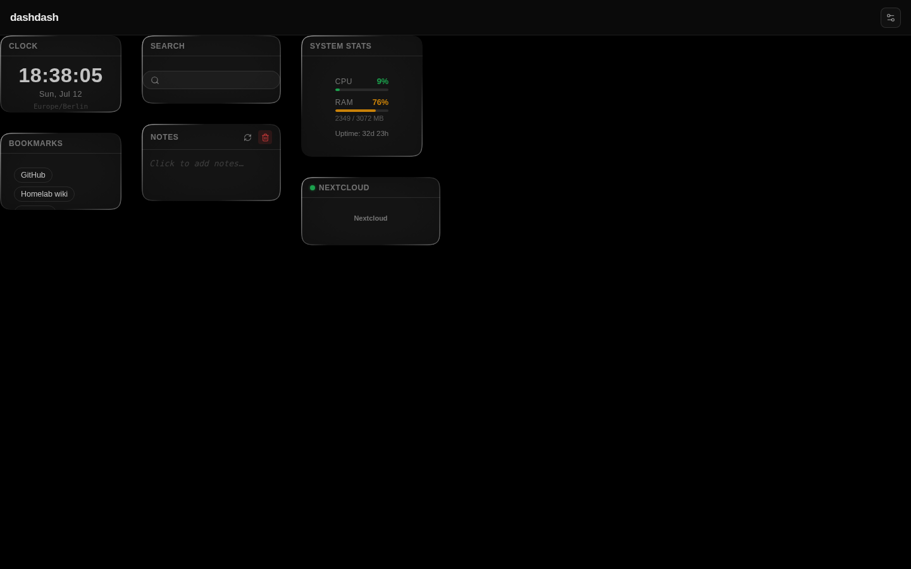
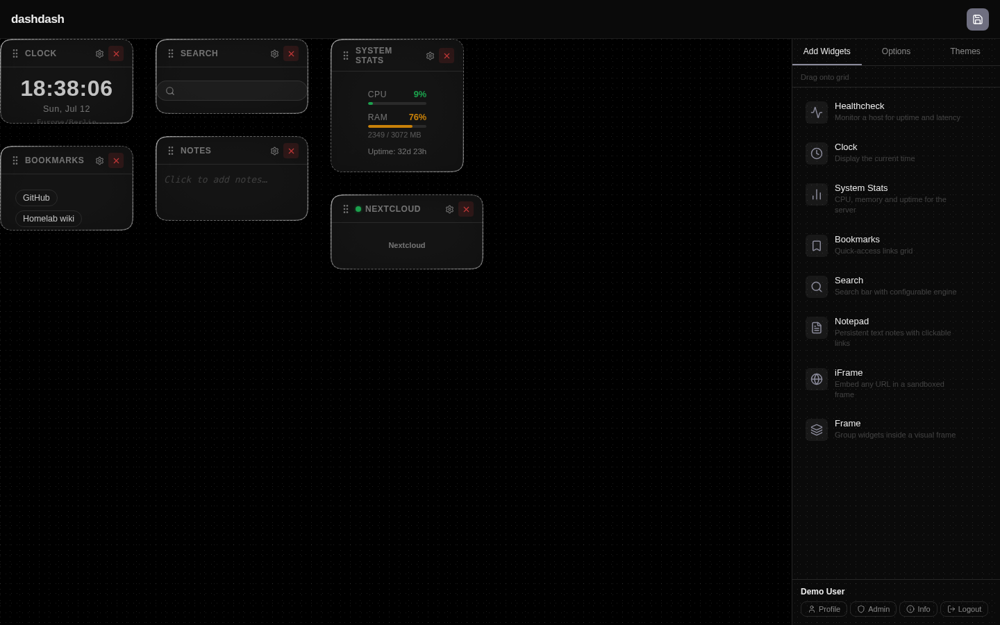
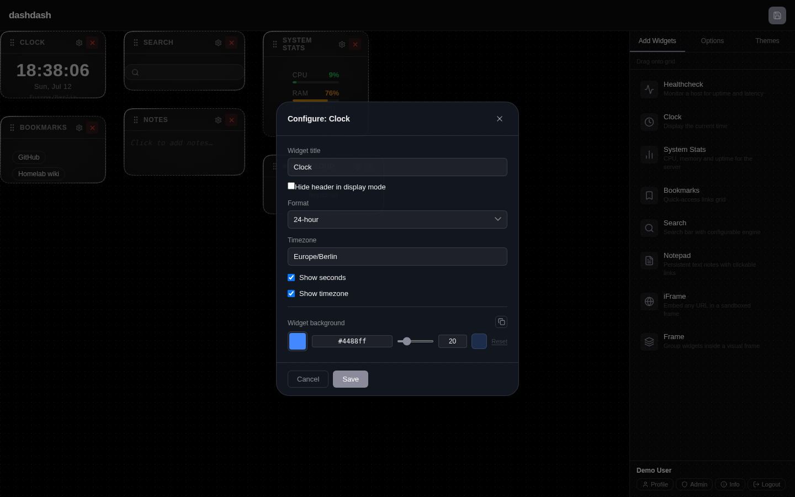

# dashdash

> A self-hosted personal dashboard. YAML-first, drag-and-drop, multi-user — designed for homelabs.

---

## Screenshots

| Board (Liquid Glass theme) | Edit mode | Widget config |
|---|---|---|
|  |  |  |

---

## Features

- **Drag-and-drop grid** — arrange and resize widgets however you like; layout is saved per user
- **Live YAML config** — change services or layout in a text file and it reloads instantly, no restart needed (mail/auth settings in `settings.yml` load at startup and need a restart)
- **Multiple themes** — Liquid Glass, Classic, and ASCII out of the box; add your own with a single CSS file
- **Service status monitoring** — ICMP or TCP healthchecks with a subtle status dot right in the widget header; unconfigured/unreachable targets show honestly as "unknown" rather than a false pass
- **First-run starter board** — a curated set of widgets on first install, not an empty grid or arbitrary seed data
- **Service icons** — put a face to every app from a built-in icon library; recognise your services at a glance
- **Credentials stay on the server** — API keys are never exposed to the browser; all external calls go through the backend
- **Multiple boards** — organise widgets across several boards and switch between them in one click
- **Multi-user with SSO** — local accounts or single sign-on via any OIDC provider (Authentik, Keycloak, …)
- **Widgets** — service status, bookmarks, notepad, chat, clock, search bar, embedded pages, and more

---

## Tech stack

| Layer | Choice |
|---|---|
| Frontend | React 19, Vite 8, SWR, Zustand |
| Grid | react-grid-layout |
| Backend | Node.js 22, Fastify |
| Database | SQLite (better-sqlite3) |
| Config | YAML + Zod 4, live reload via chokidar |
| Auth | Local + OIDC Authorization Code + PKCE (openid-client) |
| Packaging | pnpm workspaces, Docker multi-stage build |

---

## Installation

### Docker Compose (recommended)

```yaml
services:
  dashdash:
    image: ghcr.io/theswoosh/dashdash:latest
    ports:
      - "3000:3000"
    volumes:
      - ./config:/config
      - ./data:/data
    restart: unless-stopped
```

```bash
# Copy example configs, then start
cp config/settings.yml.example config/settings.yml
cp config/services.yml.example config/services.yml
docker compose up -d
```

Open `http://localhost:3000` and register — the first account created becomes the admin.

### Config files

All configuration lives in the `/config` volume:

| File | Purpose |
|---|---|
| `settings.yml` | Theme, background, grid defaults, mail (SMTP), auth |
| `services.yml` | Widget instances |
| `integrations.yml` | Named API sources |

Annotated examples are in `config/*.yml.example`.

Healthchecks against private/LAN IP ranges are allowed by default
(`allowPrivateNetworks: true`) — dashdash's primary use case is monitoring
hosts on your own network. On multi-user or internet-exposed deployments,
set `allowPrivateNetworks: false` in `settings.yml` to re-enable the SSRF
guard: it blocks server-side probes of RFC-1918/loopback/link-local
targets, including DNS rebinding (a public hostname resolving to a private
IP).

### API credentials

Credentials are passed via environment variables — never stored in config files:

```env
BOARD_INTEGRATION_<ID_UPPERCASE>_KEY=your-api-key
```

See `.env.example` for supported variables.

### SSO / OIDC

Set three environment variables and the "Sign in with SSO" button appears automatically:

```env
BOARD_OIDC_ISSUER=https://auth.example.com/application/o/dashdash/
BOARD_OIDC_CLIENT_ID=dashdash
BOARD_OIDC_SECRET=your-client-secret
```

Optional:

| Variable | Default | Effect |
|---|---|---|
| `BOARD_OIDC_SCOPES` | `openid profile email` | Scopes requested at the authorization endpoint |
| `BOARD_OIDC_GROUPS_CLAIM` | _(none)_ | ID-token claim holding the user's group names (array) |
| `BOARD_OIDC_ADMIN_GROUP` | _(none)_ | Exact group name that grants the admin role on first OIDC login |
| `BOARD_OIDC_AUTO_LINK` | `true` | Link an OIDC login to an existing local account with the same **verified** email, instead of provisioning a second account |
| `BOARD_OIDC_ALLOW_HTTP` | `false` | Allow a plain-http issuer (explicit opt-in for LAN/test IdPs; keep HTTPS in production) |

Notes from verification:

- The very first user to ever log in — local or OIDC — becomes admin, regardless of group membership.
- OIDC requires the provider to assert `email_verified: true`; unverified emails are refused with a clear login-screen error.
- Auto-linking does not disable the local password — a linked account can still sign in with either method (dual login).
- With auto-linking disabled, an OIDC login whose email already belongs to a local account is refused with a clear login-screen error, rather than being linked or duplicated.
- The displayed name comes from the ID token's `name` claim, falling back to `preferred_username`, then the email address.
- Logout is RP-initiated (sends `id_token_hint` and `post_logout_redirect_uri` to the provider) — the IdP client must allowlist dashdash's URL as a post-logout redirect URI for this to fully end the provider session.
- Resetting a password invalidates all of that user's active sessions.
- The login rate limit (5 attempts per 15 minutes, per email) is stored in SQLite and survives a backend restart.

---

## Development

Requires Node.js 22 and pnpm.

```bash
pnpm install
pnpm dev
```

- Frontend: `http://localhost:3000`
- Backend API: `http://localhost:4000`

---

## Support

If you find dashdash useful, consider buying me a coffee.

[](https://ko-fi.com/welikecoffee)
